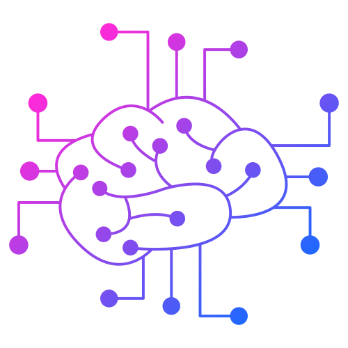

[![Forks][forks-shield]][forks-url]
[![Stargazers][stars-shield]][stars-url]
[![Issues][issues-shield]][issues-url]
[![MIT License][license-shield]][license-url]
[![LinkedIn][linkedin-shield]][linkedin-url]

<!-- PROJECT LOGO -->
<br />
<p align="center">
    

  <h2 align="center">Portfolio Website</h2>

  <p align="center">
    A portfolio website designed to showcase my skills
    <br />
    <a href="http://www.animikh.me/">View Demo</a>
    ·
    <a href="https://github.com/animikhaich/portfolio-website/issues/new">Report Bug</a>
  </p>
</p>

![Portfolio Website][product-screenshot]

<!-- TABLE OF CONTENTS -->

## Table of Contents

- [Table of Contents](#table-of-contents)
- [About The Project](#about-the-project)
- [Demo](#demo)
- [Getting Started](#getting-started)
  - [Built With](#built-with)
  - [Installation](#installation)
- [Roadmap](#roadmap)
- [Contributing](#contributing)
- [License](#license)
- [Contact](#contact)
    - [Animikh Aich](#animikh-aich)
- [Acknowledgements](#acknowledgements)

<!-- ABOUT THE PROJECT -->

## About The Project

This is a Static Responsive Portfolio Website based on HTML/CSS and JavaScript. Even though I have modified it heavily as per my requirements, it is not originally designed/developed by me. The credits for most of the graphics on the website as well as the base structure goes to [Akshay Kashyap](https://github.com/akashyap2013). Please check the [Acknowledgements](#acknowledgements) section for details.

Disclaimer: By no means am I web developer. I am just familiar with the fundamentals and modified an existing template codebase. Hence, please excuse bad code practices :)

## Demo

Visit the Live Website: [http://animikh.me/](http://www.animikh.me/)

<!-- GETTING STARTED -->

## Getting Started

This is a static website, so it be viewed on Web Browser using any web-server (PHP, Node, etc).

### Built With

All components used can be used to build static websites:

- [HTML](https://developer.mozilla.org/en-US/docs/Web/HTML)
- [CSS](https://developer.mozilla.org/en-US/docs/Web/CSS)
- [JavaScript](https://developer.mozilla.org/en-US/docs/Web/JavaScript)
- [Font Awesome](https://fontawesome.com/)
- [Bootstrap](https://getbootstrap.com/)
- [Isotope JS](https://isotope.metafizzy.co/)
- [Owl Carousel JS](https://owlcarousel2.github.io/OwlCarousel2/)

### Installation

1. Clone the repo

```sh
git clone https://github.com/animikhaich/portfolio-website.git
```

1. Run on your favorite web-browser

<!-- ROADMAP -->

## Roadmap

See the [open issues](https://github.com/animikhaich/portfolio-website/issues?q=is%3Aopen) for a list of proposed features (and known issues).

<!-- CONTRIBUTING -->

## Contributing

Contributions are what make the open source community such an amazing place to be learn, inspire, and create. Any contributions you make are **greatly appreciated**.

1. Fork the Project
2. Create your Feature Branch (`git checkout -b feature/AmazingFeature`)
3. Commit your Changes (`git commit -m 'Add some AmazingFeature'`)
4. Push to the Branch (`git push origin feature/AmazingFeature`)
5. Open a Pull Request

<!-- LICENSE -->

## License

Distributed under the MIT License. See [LICENSE](LICENSE.md) for more information.

<!-- CONTACT -->

## Contact

#### Animikh Aich

- Website: [Animikh Aich - Website](http://www.animikh.me/)
- LinkedIn: [animikh-aich](https://www.linkedin.com/in/animikh-aich/)
- Email: [animikhaich@gmail.com](mailto:animikhaich@gmail.com)
- Twitter: [@AichAnimikh](https://twitter.com/AichAnimikh)

<!-- ACKNOWLEDGEMENTS -->

## Acknowledgements

- [akashyap2013 - PortFolio_Website](https://github.com/akashyap2013/PortFolio_Website)
- [Daily Tuition - YouTube](https://www.youtube.com/channel/UCrG2Z0usOCCdUTAr4D1A8mw)

<!-- MARKDOWN LINKS & IMAGES -->

[contributors-shield]: https://img.shields.io/github/contributors/animikhaich/portfolio-website.svg?style=flat-square
[contributors-url]: https://github.com/animikhaich/portfolio-website/graphs/contributors
[forks-shield]: https://img.shields.io/github/forks/animikhaich/portfolio-website.svg?style=flat-square
[forks-url]: https://github.com/animikhaich/portfolio-website/network/members
[stars-shield]: https://img.shields.io/github/stars/animikhaich/portfolio-website.svg?style=flat-square
[stars-url]: https://github.com/animikhaich/portfolio-website/stargazers
[issues-shield]: https://img.shields.io/github/issues/animikhaich/portfolio-website.svg?style=flat-square
[issues-url]: https://github.com/animikhaich/portfolio-website/issues
[license-shield]: https://img.shields.io/github/license/animikhaich/portfolio-website.svg?style=flat-square
[license-url]: https://github.com/animikhaich/portfolio-website/blob/master/LICENSE.md
[linkedin-shield]: https://img.shields.io/badge/-LinkedIn-black.svg?style=flat-square&logo=linkedin&colorB=555
[linkedin-url]: https://linkedin.com/in/animikh-aich/
[product-screenshot]: img/screenshot.png
